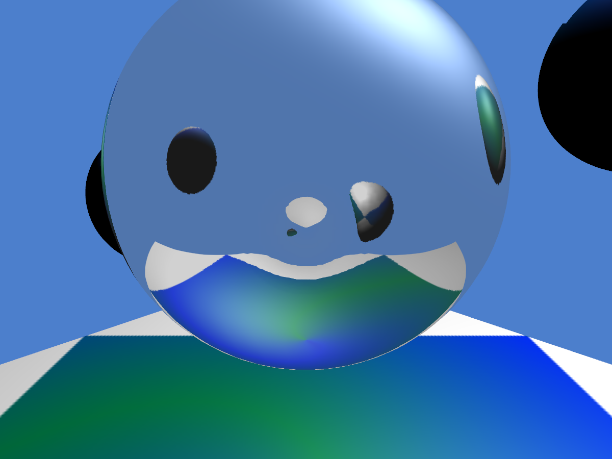

=========================
Reflective Ball in OpenGL
=========================

|illustration|

My final project for the course TDT4230 Graphics and Visualization at the Norwegian University of Science and Technology (`NTNU`_). The project is based on  `gloom`_, but stripped down a bit to provide minimal size.

Dependencies
============

* `CMake`_ (3.0+) 
* OpenGL (4.5+)

Getting started
===============

Download
--------

Simply clone this repository:

.. code-block:: bash

  git clone https://github.com/TheVaffel/reflective-sphere

Compilation
-----------

Linux (command-line)
~~~~~~~~~~~~~~~~~~~~

The following will (hopefully) suffice to compile the project:

.. code-block:: bash
  
  # Enter the repository
  cd reflective-sphere 

  # Make a build folder
  mkdir build

  # Enter build folder
  cd build

  # Generate UNIX Makefile (point CMake to CMakeLists.txt)
  cmake ..

  # Execute make command
  make

  # Run executable
  ./gloom/gloom

Specific generators can also be specified with CMake if you want to create workspaces for an IDE, for example:

.. code-block::

  cmake -G "CodeBlocks - Unix Makefiles"

(This is part of the gloom README, and I have not tested this last step)

Windows (cmake-gui)
~~~~~~~~~~~~~~~~~~~

1. Set the source code file to the root directory containing ``CMakeLists.txt``
2. Binaries can be built in the directory of your choice, e.g. ``reflective-sphere\build\``
3. Click the configure button and select which generator you would like to use
4. Click the generate button
5. If your generator is an IDE such as Visual Studio, then open up the newly created .sln file and build ``ALL_BUILD``. 

Documentation
=============

A brief description of the project is contained in the report provided, apart from that, the comments scattered throughout the code is the only documentation available to this date.

.. Links

.. _NTNU: https://www.ntnu.edu/
.. _CMake: https://cmake.org/
.. _gloom: https://github.com/senbon/gloom

